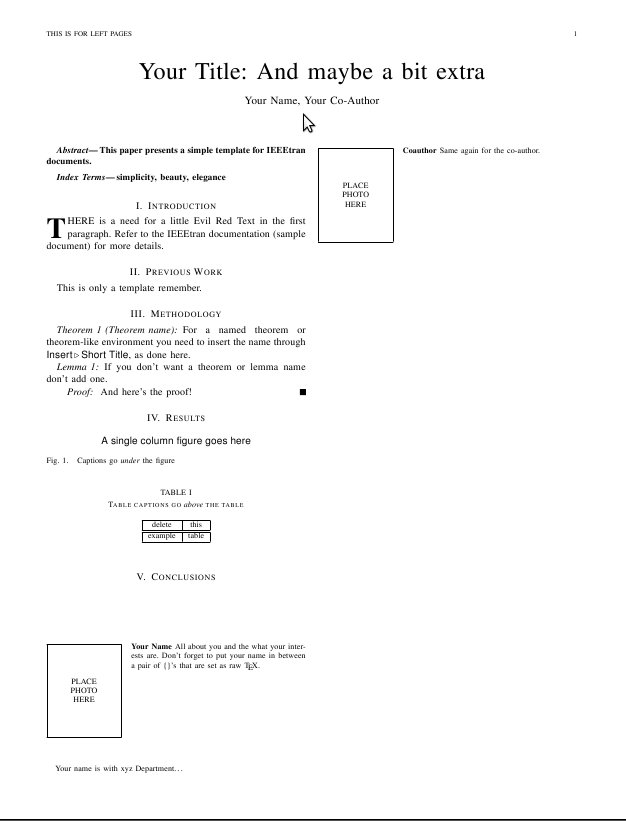
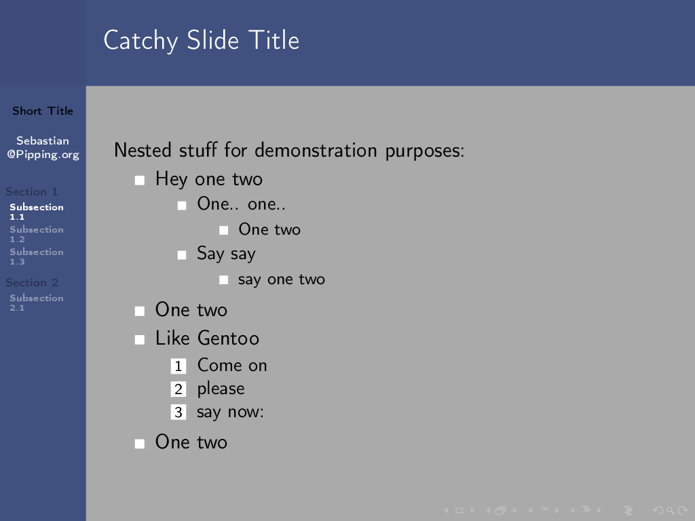

latex input:	mmd-article-header
Affiliation:		ESIR	
CSS: 	http://fletcherpenney.net/css/document.css
xhtml header:  

 
### Les goûts et et les couleurs :) ###

+ WYSIWYG ( What You See Is What You Get  ) 
+ WYSISYM ( What You See Is What You Mean ) 

![Gouts][Gouts]

[Gouts]: ./images/gouts.jpg " " height="4cm"

### WYSIWYG vs WYSISYM  ###

+ WYSIWYG
	+ Avantages 
		+ prise en main immédiate 
		+ agréable 
+ WYSIWYM
	+ Avantages
		+ structurant 
		+ format texte 
		+ qualité du document final 
 	+ Inconvénients 
		+ lourdeur et lenteur liées à la compilation 
		+ le balisage peut être parasite 	
		+ apprentissage plus long

## Le language LaTex ##

Dans cette section on donne quelques exemples simples d'utilisation de LaTex. 
Pour les fonctionnalités avancées, se reporter à []

### Généralités ### 

* [LaTex](http://fr.wikipedia.org/wiki/LaTeX) est un langage de composition de documents
* Permet de produire des documents de grande qualité (orienté mathématiques)
* Méthode privilégié d'écriture de documents scientifiques 
* .tex --> .dvi --> .pdf ou .ps 

![Tex : Donald Knuth][Knuth] ![Latex : Leslie Lamport][Lamport] 
		 

[Knuth]: ./images/Knuth.jpg "Tex : Donald Knuth " height="3cm"
[Lamport]: ./images/Lamport.jpg "LaTex : Leslie Lamport" height="3cm"

### Etude d'un premier document ### 

doc.tex 

		\documentclass{article}
		% commentaire
		\begin{document}
			Un nouveau document 
		\end{document}

		latex doc.tex 
			doc.dvi 

### Organisation hiérarchique du document ###

Le document est organisé hiérarchiquement 

* Classe Article ( 4 niveaux ) 
	* subsection{}	 
	* subsubsection{}
	* paragraph{}

* Classe Memoir ( 6 niveaux ) 

	* part{}
	* chapter{}
	* section{} ...

### Un exemple de rapport ###

	\documentclass[12pt,a4paper,utf8x]{report}
	\usepackage [frenchb]{babel}
	% Faux texte 
	\usepackage{lipsum}
	\usepackage{kantlipsum}
	% Encodage  utf8
	\usepackage{ucs}
	\usepackage[utf8x]{inputenc}

	\usepackage{url} % gestion des url
	\usepackage {geometry}

### Un exemple d'article ### 

### Figures et graphiques ###

* Les graphiques doivent être légendés sur les deux axes 
* Il faut donner une légende 

### packages utiles ###

\usepackage[frenchb]{babel}
: Prendre en compte les particularités de la typographie française.

\usepackage[latin1]{inputenc} 
: Prendre en compte les caractères accentués

\usepackage{graphicx} 
: gestion des images (jpg, png, eps, etc...)

\usepackage{utf8} 
: gestion de l'encodage Utf8

### packages utiles (suite) ###

\usepackage[T1]{fontenc} 
: Utiliser les polices de Type1

\usepackage{geometry} 
: Modifier les marges

\usepackage{pstricks} 
: Utiliser PSTricks

### packages utiles (suite) ###

\usepackage{multido} 
: boucle "for"

\usepackage{color} 
: couleur (voir aussi xcolor)

\usepackage{verbatim} 
: insertion code source

### packages utiles (suite) ###

\usepackage{lstlisting} 
: insertion code source

\usepackage{url} 
: url en verbatim

\usepackage{tabularx} 
: tableau étendu

\usepackage{slashbox} 
: diagonale dans un tableau

### packages utiles (suite) ###

\usepackage{multicol} 
: multicolonne

\usepackage{picins} 
: Figure insérée dans le texte

\usepackage{framed} 
: encadre des paragraphes entiers

\usepackage{amsmath} 
: package ams-math

\usepackage{amsfonts} 
: package ams-fonts

\usepackage{amssymb}
: package ams-symb

### package algorithmic ###

<!-- 
\begin{algorithmic}
\IF {$i\geq maxval$} 
        \STATE $i\gets 0$
\ELSE
        \IF {$i+k\leq maxval$}
                \STATE $i\gets i+k$
        \ENDIF
\ENDIF 
\end{algorithmic}
-->

## La classe beamer ##

La classe LaTex beamer est un outil adapté à la réalisation de présentations au format pdf

### Qu'est ce que Beamer ? ###

[Beamer](http://latex-beamer.sourceforge.net/ "The LaTeX Beamer Class
Homepage") est une classe [LaTeX](http://www.latex-project.org/) qui permet la réalisation 
de présentation PDF. 

**Ce document est produit à l'aide de MultiMarkdown et Beamer**

### Exemple de frame ###

<!--
\framesubtitle{La preuve utilise \textit{reductio ad absurdum}.}
\begin{theorem}
Il n'existe pas un plus grand nombre premier 
\end{theorem}
\begin{proof}
\begin{enumerate}
\item<1-| alert@1> Supposons que $p$ soit le plus grand des nombres premiers
\item<2-> Soit $q$ le produit des nombres de 1 à $p$
\item<3-> Alors $q+1$ n'est divisible par aucun de ces nombres
\item<4-> $q + 1$ est donc premier et plus grand que  $p$ \qedhere
\end{enumerate}
\end{proof}
-->

### Les Thèmes Beamer ###
[Thèmes Beamer](http://www.hartwork.org/beamer-theme-matrix/)

 

## Markdown et Multimarkdown ##

Un fichier markdown est conçu pour être compréhensible 

Un document Markdown doit être lisible en l'état.  

### Philosophie de Markdown ###

* L'accent est mis sur la lisibilité 
* Format plain text 
* Les éléments de syntaxe expriment ce qu'ils signifient

		**En gras**, *en italique* [^notedebasdepage]

		 [^notedebasdepage]: Ceci est une note de bas de page

**En gras**, *en italique* [^notedebasdepage]

[^notedebasdepage]: Ceci est une note de bas de page

### Listes ### 

	+ To Do List
		* Nothing 
	
+ To Do List
	* Nothing 

![ToDo][ToDo]

[ToDo]: ./images/todo.jpg " " height="3.5 cm"

### Liste de définition ### 
	

		Orange
                :        Couleur de l'arc en ciel ? 
		:	 Fruit de l'oranger
		:	 Une firme française

Orange
:        Couleur de l'arc en ciel ? 
:	 Fruit de l'oranger
:	 Une firme française

### Enumération ###

		1. Un 
		1. Deux 
		1. Trois 

1. Un 
1. Deux 
1. Trois 
 

### MultiMarkdown - C'est quoi au juste ? ###

[MultiMarkdown](http://fletcherpenney.net/multimarkdown/ "MultiMarkdown") c'est une extension de Markdown de John Gruber's [Markdown](http://daringfireball.net/projects/markdown/ "Daring Fireball: Markdown").

Conversion de texte brut en documents de différents formats:

* HTML
* PDF
* ODF (Open Data Format)
* presentations beamer (PDF)

### fonctionalités de Multi Markdown ###

* notes de bas de pages 
* tables 
* citations et bibliography (support de BibTeX)
* support des équations mathématiques
* possibilité de cross-référencement 
* typographie *smart*
* Possibilité de fixer les attributs des images 
* Légendes des tables et des figures 
* Listes 
* Méta données de document (e.g. titre, auteur, etc.)

### Multimarkdown tips ###

* Attention à passer des lignes après les titres 

### Programmes à installer ###

Il est nécessaire d'installer 

* MultiMarkdown
* LaTeX (en incluant pdflatex)
* la classe beamer

*Si vous êtes en mesure de compiler un document PDF à partir d'un fichier Latex, vous pouvez commencer.*

### Créer un document Multimarkdown MMD ###

### Inclure les  metadonnées nécessaires ###

Vous pouvez utiliser les metadata suivantes :

	latex input:	mmd-beamer-header
	Title:			Mon titre
	Subtitle:		Mon sous-titre 
	Date:			Une date 
	Author:			Le nom de l'auteur
	Affiliation:	        L'affiliation
	LaTeX xslt:		beamer
	latex mode:		beamer 
	event:			an optional event name
	theme:			an optional beamer theme to use
	latex input:	mmd-beamer-begin-doc
	latex footer:	mmd-beamer-footer

### Insertion d'images ###

	![\[f(z)=\frac{(z^2-1)(z-2-i)^2}{(z+2+i)^2}\]][complexe]
	[complexe]: ./images/complex.jpg " " width="4 cm"

![ \\[ f(z) = \frac{(z^2-1)(z-2-i)^2}{(z+2+i)^2} \\] ][complexe]

[complexe]: ./images/complex.jpg " " width="4 cm"

### Insertion d'un tableau  ###

	| Première            | Seconde             | Troisième |  
	| ------------------- | ------------------- | --------- |  
	| Une cellule longue  | courte              | courte    |  
	| courte              | un peu plus longue  | short     |  

| Première            | Seconde             | Troisième |  
| ------------------- | ------------------- | --------- |  
| Une cellule longue  | courte              | Courte    |  
| courte              | un peu plus longue  | short     |  

### Introduire une bibliograhie ### 

### Les Mathématiques ###
	
	\\[ \frac{ac}{cb}= \frac{a}{b} \\]

\\[ \frac{ac}{cb}= \frac{a}{b} \\]

+ Utile pour visualiser des mathématiques 
+ ... mais aussi pour en faire 
+ la recopie d'une étape intermédiaire dans un éditeur de texte est rapide et sans erreur
 
### Symboles (1) ###

	\ldots	\cdots	\vdots
	\ddots	\pm	\mp
	\times	\div	\ast
	\star	\circ	\bullet

 \\[ \begin{array}{ccc} 
	 \ldots	& \cdots	& \vdots \\\\
	 \ddots	& \pm	&	\mp \\\\ 
 	\times	& \div	&	\ast \\\\ 
	\star   & \circ	&       \bullet 
 \end{array}  \\] 

### package babel 

	\og \fg \up{2} \bsc{Lamport} 1\ier 2\ieme \primo \secundo \tertio \quarto 
	\no \No \nos \Nos 40\degres

<!-- \og \fg \up{2} \bsc{Lamport} 1\ier 2\ieme \primo \secundo \tertio \quarto 
\no \No \nos \Nos 40\degres -->

###  MultiMarkdown et Beamer ###

Il est possible de convertir un fichier MultiMarkdown en une présentation Beamer.
 
## Liens Utiles ##

[Byword MultiMarkdown Guide](http://bywordapp.com/markdown/guide.html)
[List of Tables](http://techxplorer.com/2011/10/03/multimarkdown-and-lists-of-tables-and-figures-in-pdf-output/)
[A not so short Introduction to Latex](http://tobi.oetiker.ch/lshort/lshort.pdf)
[Une courte introduction à Latex](http://mirror.ibcp.fr/pub/CTAN/info/lshort/french/lshort-fr.pdf)
[CTAN](http://www.ctan.org)
[MikTex](http://miktex.org)
[LyX](http://www.lyx.org)

### Trucs et Astuces ###

+ Nom de chemins en relatif (./images/ ou ../images/)
+ Automatiser - Utiliser un Makefile

## Makefile de ce document ##

		all: pres report odf html

		pres: content.mkd
			cat entete-beamer > pres.mkd
			cat content.mkd >> pres.mkd 
			multimarkdown -t latex pres.mkd -o pres.tex
			filter pres.tex
			pdflatex pres.tex > /dev/null

		report: content.mkd		
			cat entete-memoir > report.mkd
			cat content.mkd >> report.mkd 
			multimarkdown -t latex report.mkd -o report.tex
			filter report.tex
			pdflatex report.tex > /dev/null

		html: content.mkd 
			cat entete-html > web.mkd
			cat content.mkd >> web.mkd
			multimarkdown web.mkd > web.html 

		odf: content.mkd 
			multimarkdown -t odf content.mkd > content.fodt

